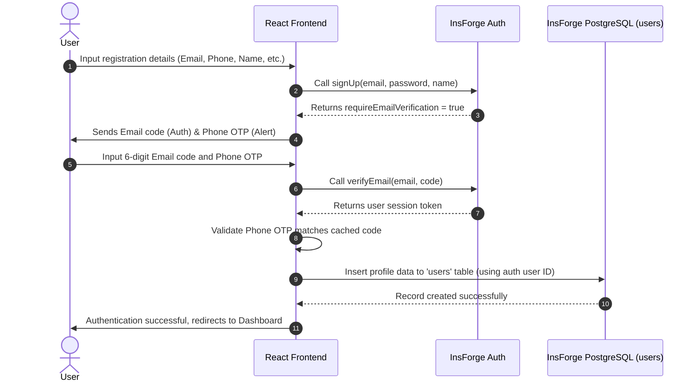
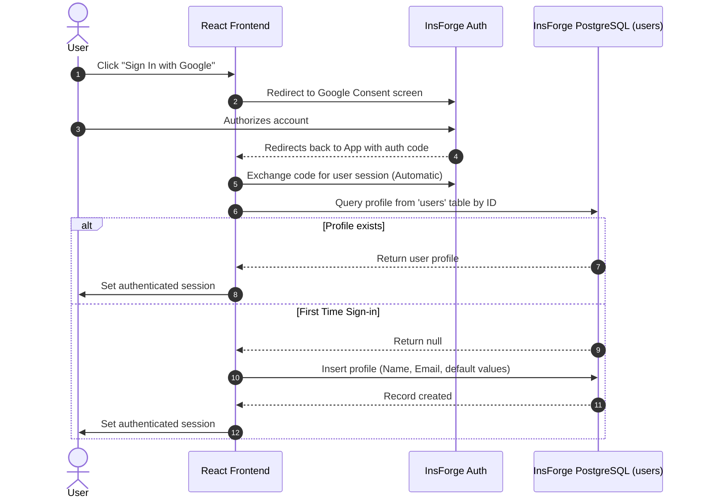
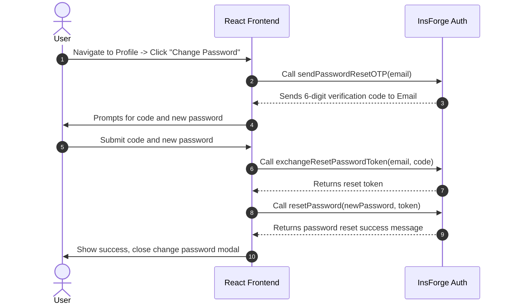
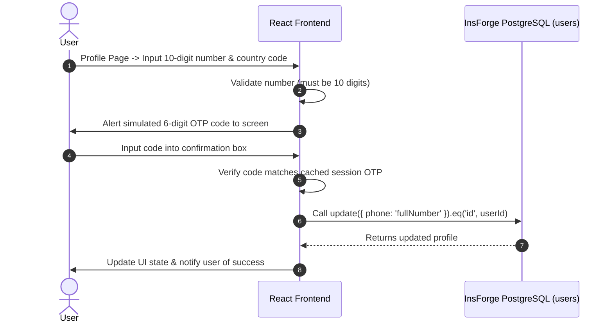
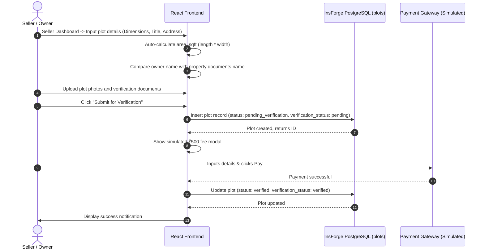

# TerraVilla Real Estate Platform

TerraVilla is a premium, secure, peer-to-peer land transaction platform designed to enable transparent and direct land deals. It removes the middleman by providing zero broker fees, maximum transparency, automated government record verification checks, and escrow transaction pathways.

---

## 🛠️ Technology Stack

- **Frontend**: React (Vite, Javascript, HTML5)
- **Styling**: Tailwind CSS (v3.4) & Vanilla CSS for premium micro-animations
- **Icons**: Lucide React
- **BaaS Backend**: **InsForge**
  - **Database**: PostgreSQL (PostgREST API)
  - **Authentication**: Email/Password + Google OAuth (Gmail)
  - **Realtime**: WebSockets

---

## ⚡ Key Features

1. **Dual OTP Signup Verification**: Requires verification codes sent to both the user's email (via InsForge server) and phone (via simulated 6-digit OTP code) to activate an account.
2. **Profile Syncing & Roles**: Automatically creates and synchronizes user profile records in the InsForge PostgreSQL `users` table on registration or first-time Google OAuth sign-in. User role (`user_type` = `buyer`, `seller`, or `both`) controls visibility of listing features.
3. **Change Password via OTP**: Change account passwords securely by triggering an email verification code and resetting via InsForge.
4. **10-Digit Phone Verification**: Update and verify a new 10-digit phone number with country code via OTP verification before saving to the database.
5. **Government KYC checks**: Seamless workflow to submit government IDs for KYC checks.
6. **Property Listing Escrow**: Listing dashboard allowing sellers to upload photos/deeds, pay a simulated ₹500 listing verification fee, and instantly list plots.
7. **Escrow Transactions**: Secure peer-to-peer escrow payments for buying and selling property listings.

---

## 🔄 Project Workflows

### 1. User Registration & Sync Workflow



---

### 2. Google OAuth Sign-In & Sync Workflow



---

### 3. Password Reset & Change Workflow



---

### 4. Phone Number Update & Verification Workflow



---

### 5. Property Listing & Payment Verification Workflow



---

## 🚀 Running the Project

### Prerequisites
1. Node.js installed on your machine.
2. An InsForge BaaS project credentials.

### Environment Setup
Create a `.env` file in the root directory:
```env
VITE_INSFORGE_URL=https://your-insforge-app-url.app
VITE_INSFORGE_ANON_KEY=your-anon-key-here
```

### Installation
Install the required packages:

# TerraVilla

TerraVilla is a broker-free land marketplace prototype where buyers and sellers can discover, list, and manage property transactions with a modern React UI.

The app is currently frontend-focused and uses mock data + `localStorage` persistence.

## Overview

TerraVilla is designed to make land transactions more transparent by:

- Reducing broker dependency
- Showing market pricing insights
- Simulating verification and listing workflows
- Supporting buyer and seller flows in one product

## Tech Stack

### Core
- React 18
- Vite 5
- JavaScript (JSX)

### Styling/UI
- Tailwind CSS
- Lucide React

### Tooling
- ESLint (flat config)
- PostCSS + Autoprefixer

### Language Status
- JavaScript + JSX only
- No TypeScript files or TypeScript dev dependencies


## Features

- OTP-based mock auth flow (login/signup)
- Property search with city/state/price filters
- Property detail modal and seller contact CTA
- Seller listing workflow with multi-step form
- Mock document/image upload + mock listing fee payment
- Seller listing management (view/delete)
- Market insights section with recent listings
- Profile page with mock KYC flow

## Project Structure

```text
src/
  components/
    Ads/
    Auth/
    Home/
    Market/
    Payment/
    Profile/
    Search/
    Seller/
    Navbar.jsx
  context/
    AuthContext.jsx
  data/
    mockData.js
  utils/
    plotUtils.js
    priceFormatters.js
  App.jsx
  main.jsx
  index.css
supabase/
  migrations/
```

## Getting Started

### Prerequisites
- Node.js 18+
- npm 9+

### Install


```bash
npm install
```


### Run Locally
Launch the Vite local development server:

### Start Dev Server


```bash
npm run dev
```


### Build Production Bundle
To compile and bundle assets for production:
```bash
npm run build
```
The built assets will be exported to the `/dist` directory.

Open the URL shown in terminal (typically `http://localhost:5173`).

## Scripts

- `npm run dev` - Start development server
- `npm run build` - Create production build
- `npm run preview` - Preview production build locally
- `npm run lint` - Run ESLint

## Data and Persistence

Current storage model:

- Initial listings come from `src/data/mockData.js`
- Runtime listing operations are in `src/utils/plotUtils.js`
- Listings persist in `localStorage` key: `terraVillaPlots`
- Session user persists in `localStorage` key: `user`

To reset app state during testing, clear browser local storage.

## Notes

- This project intentionally runs on React + JavaScript only.
- If you clone fresh, run `npm install` to sync lockfile and dependencies.


